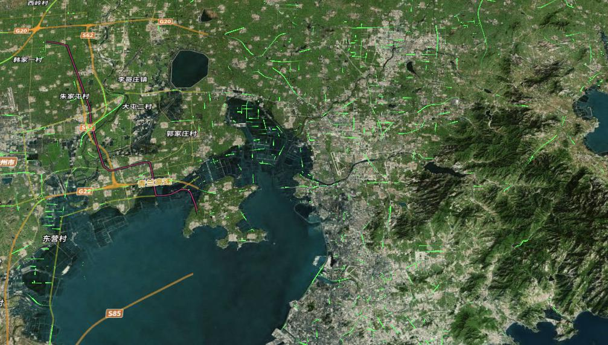

# GIS CESIUM 动态线条材质 闪烁，图片，高亮
## 动态效果材质

### 视频
[动态效果材质](README_files/WeChat_20230915130946.mp4)
### 引入依赖
```javascript
import * as Cesium from 'cesium'
// 闪烁条纹材质，材质图片条纹材质，渐变高亮条纹材质
import { LineFlickerMaterial, Spriteline1Material, GradientHilightMaterial } from 'LineMaterial'
```
### 使用方式
- 1.加载虚拟数据以展示材质。青岛高速路网geojson。(文件目录example/public/qingdaoRoad.geojson)
- 2.材质使用方式，new 材质名(配置项)
**onMounted中，或自定义的加载函数中**
```javascript
const viewer = ref(null)
onMounted(() => {
  // 初始化视图viewer
  viewer.value = new Cesium.Viewer('cesiumContainer', {
    terrain: Cesium.Terrain.fromWorldTerrain(),
    animation: false,
    baseLayerPicker: false,
    vrButton: false,
    geocoder: false,
    homeButton: false,
    timeline: false,
    sceneModePicker: false,
    infoBox: false,
    navigationHelpButton: false
  });
  // 加载虚拟数据 将qingdaoRoad.geojson文件复制到目录/public/qingdaoRoad.geojson
  // 加载文件目录中的数据
  Cesium.GeoJsonDataSource.load("/qingdaoRoad.geojson").then(function(dataSource) {
    viewer.value.dataSources.add(dataSource); // 
    const entities = dataSource.entities.values;
    for (let i = 0; i < entities.length; i++) {
      let entity = entities[i];
      entity.polyline.width = 3.0;
      // 设置材质
      entity.polyline.material = new LineFlickerMaterial({
        // 材质颜色
        color: Cesium.Color.YELLOW,
        // 设置随机变化速度
        speed: 20 * Math.random(),
      })
    }
  });
})

```
- 3.材质配置项
**闪烁材质效果**
```javascript
new LineFlickerMaterial({
  // 材质颜色
  color: Cesium.Color.YELLOW,
  // 设置随机变化速度
  speed: 20 * Math.random(),
})
```

**图片条纹材质效果**
```javascript
new Spriteline1Material({
  duration: 1000, // 动画时长
  image: '/gradientline.png' // 当作纹理的图片 /example/public/gradientline.png
});
```


**高亮渐变效果**
```javascript
new GradientHilightMaterial({
  color: new Cesium.Color(0.2, 1.0, 0.4, 0.8), // 材质新颜色
  speed: 15 * Math.random(), // 高亮运动速度
  percent: 0.25, // 颜色区域比例
  gradient: 0.01 // 渐变色渐变梯度
})
```
